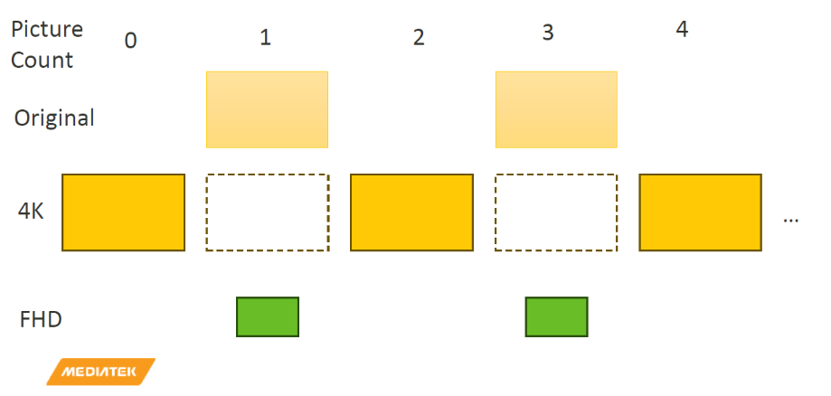
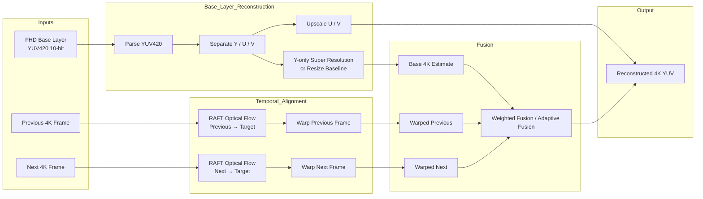

# 4K Frame Reconstruction Using RAFT-based Warping and Super-Resolution

## Overview

This project aims to reconstruct high-resolution 4K video frames from low-resolution FHD base frames and neighboring 4K reference frames. Instead of directly upscaling the FHD frame, the proposed pipeline uses temporal information from adjacent 4K frames to recover high-frequency details.

The system integrates RAFT-based optical flow estimation, backward warping, valid-mask filtering, adaptive fusion, and optional Y-channel super-resolution to improve the visual quality of generated 4K frames.

A Project Report is included in this repository:

[View Report](docs/CV_2025_Final.pdf)


## System Pipeline



## Installation

### 1. Clone the repository

```bash
git clone https://github.com/jf099005/CV_final_2026_MediaTek_group9.git
cd CV_final_2026_MediaTek_group9
```

### 2. Create a virtual environment

```bash
python -3.10 -m venv .venv
```

### 3. Activate the virtual environment
```bash 
.venv\Scripts\activate
```

### 4. Install dependencies
```bash 
pip install -r requirements.txt
```

## Usage
Run the shell script:
```bash 
bash FrameGen.sh
```

## Evaluation
```bash 
cd scriptTest
python testOddFramesAMS05.py
python testOddFramesProcession.py
python testOddFramesWalkInPark.py
python testOddFramesZombie.py
```
